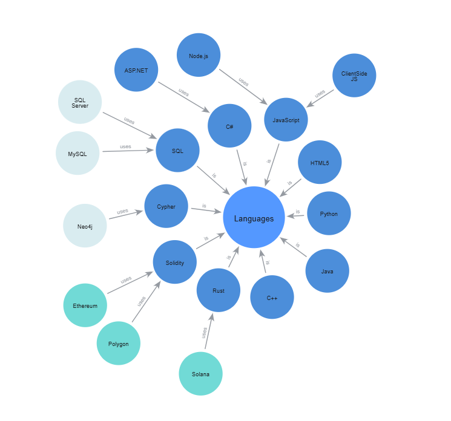

## About
Senior Full-Stack Engineer / Data and Database Engineer with 15+ years of experience designing, deploying and maintaining web applications, database architectures and server infrastructure.

Experience with SQL, Node.js, JSON, HTML5, CSS, Javascript, C# with ASP.NET, Solidity, ethers.js, Basic Tensor Flow, Basic ML, Data analysis, Simulations.

## Currently working on:

 - ERC-20, ERC-721 Custom tokens
 - Neo4J Graphing, and Graph databases
 - Linux VPS Hosting and Server Management
 - Node.js Applications (Express / EJS) with MySQL Databases
 - HTML / CSS designs and updates 
  
## In the future, looking to collaberate on projects relating to:
 
 - Data processing tools
 - Education or educational tools
 - Web3 enabled websites using smart contracts 
 - The environment and pollution detection or mitigation
 - Machine learning applications
 - Space based remote sensing data analysis
 - Projects raising awareness about:
   - The environment
   - Pollution, especially oil spills, ocean plastic, other serious pollution
   - Disasters affecting people
   - Space and Space Exploration
   - Asteroid and Comet monitoring and risks analysis and mitigation   
   - Animal welfare 

## Graph Databases

Complex Data and Relationships can be mapped in Neo4j graph databases.

Here is a visualization I made using Neo4j, showing how languages are used in Coding, Databases and Blockchains.

Visualization by RLJLW, using Neo4J, with AuraDB

The above is represents a Neo4J database of nodes and relationships that can be queried using the query language, Cypher.

<!--
**RLJLW/rljlw** is a ✨ _special_ ✨ repository because its `README.md` (this file) appears on your GitHub profile.

Here are some ideas to get you started:

- 🔭 I’m currently working on ...
- 🌱 I’m currently learning ...
- 👯 I’m looking to collaborate on ...
- 🤔 I’m looking for help with ...
- 💬 Ask me about ...
- 📫 How to reach me: ...
- 😄 Pronouns: ...
- ⚡ Fun fact: ...

-->
